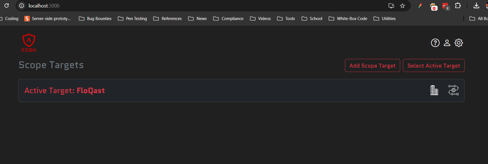
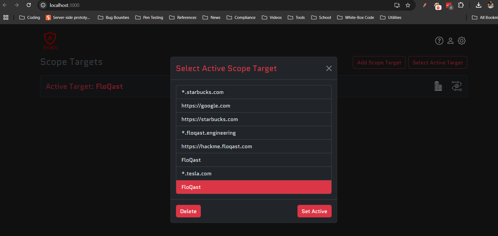
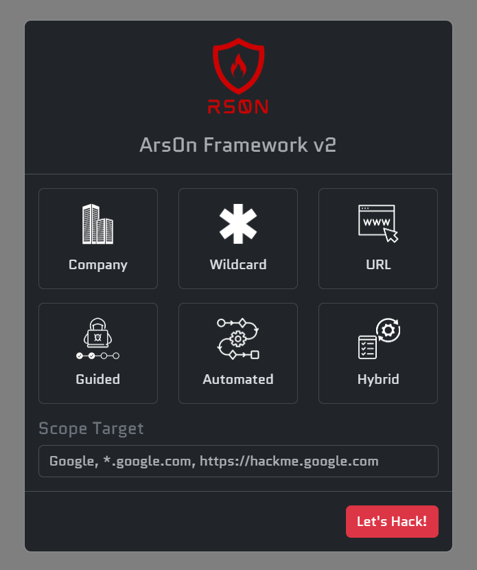

<h1 align="center">
Ars0n Framework v2
</h1>

<h3 align="center">Learn & Automate <a href="https://youtube.com/@rs0n_live">rs0n's</a> Bug Bounty Hunting Methodology</h3>

    <em>Coming DEFCON 2025 (hopefully... 🙏)</em>

<ul align="center" style="list-style-type: none; padding-left: 0;">
    <li><a href="https://github.com/owasp-amass/amass">Amass</a> - Advanced attack surface mapping and asset discovery tool for security research</li>
    <li><a href="https://github.com/projectdiscovery/subfinder">Subfinder</a> - Fast and reliable subdomain enumeration tool with multiple data sources</li>
    <li><a href="https://github.com/aboul3la/Sublist3r">Sublist3r</a> - Fast subdomain enumeration tool using various search engines and data sources</li>
    <li><a href="https://github.com/tomnomnom/assetfinder">Assetfinder</a> - Find assets related to a domain using various data sources and APIs</li>
    <li><a href="https://github.com/projectdiscovery/httpx">Httpx</a> - Fast and multi-purpose HTTP toolkit for web reconnaissance and scanning</li>
    <li><a href="https://github.com/jaeles-project/gospider">GoSpider</a> - Fast web spider written in Go for crawling and extracting URLs</li>
    <li><a href="https://github.com/nsonaniya2010/SubDomainizer">Subdomainizer</a> - Advanced subdomain enumeration tool with multiple discovery methods</li>
    <li><a href="https://github.com/digininja/CeWL">CeWL</a> - Custom word list generator that spiders websites to create targeted wordlists</li>
    <li><a href="https://github.com/projectdiscovery/shuffledns">ShuffleDNS</a> - Mass DNS resolver with wildcard filtering and validation capabilities</li>
    <li><a href="https://github.com/projectdiscovery/nuclei">Nuclei</a> - Fast and customizable vulnerability scanner with extensive template library</li>
    <li><a href="https://github.com/projectdiscovery/katana">Katana</a> - Fast and powerful web crawler for discovering hidden endpoints and content</li>
    <li><a href="https://github.com/ffuf/ffuf">FFuf</a> - Fast web fuzzer with support for multiple protocols and advanced filtering</li>
    <li><a href="https://github.com/lc/gau">GAU</a> - Get All URLs tool that fetches known URLs from various historical data sources</li>
    <li><a href="https://github.com/pdiscoveryio/ctl">CTL</a> - Certificate Transparency Log tool for discovering subdomains from SSL certificates</li>
    <li>And more!</li>
</ul>

    

    

    

## License

This project is licensed under the GNU General Public License v3.0 (GPL-3.0). This means:

- You can freely use, modify, and distribute this software
- If you distribute modified versions, you must:
  - Make your source code available
  - Include the original copyright notice
  - Use the same license (GPL-3.0)
  - Document your changes

For more details, see the [LICENSE](LICENSE) file in the repository.

Copyright (C) 2025 Ars0n Framework
